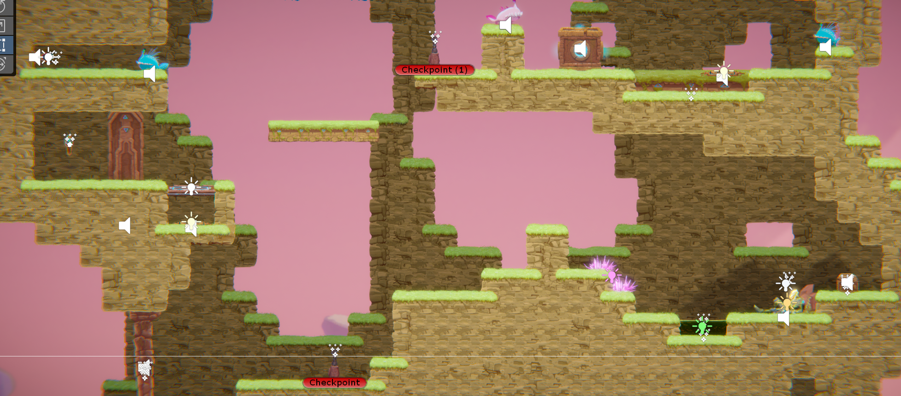
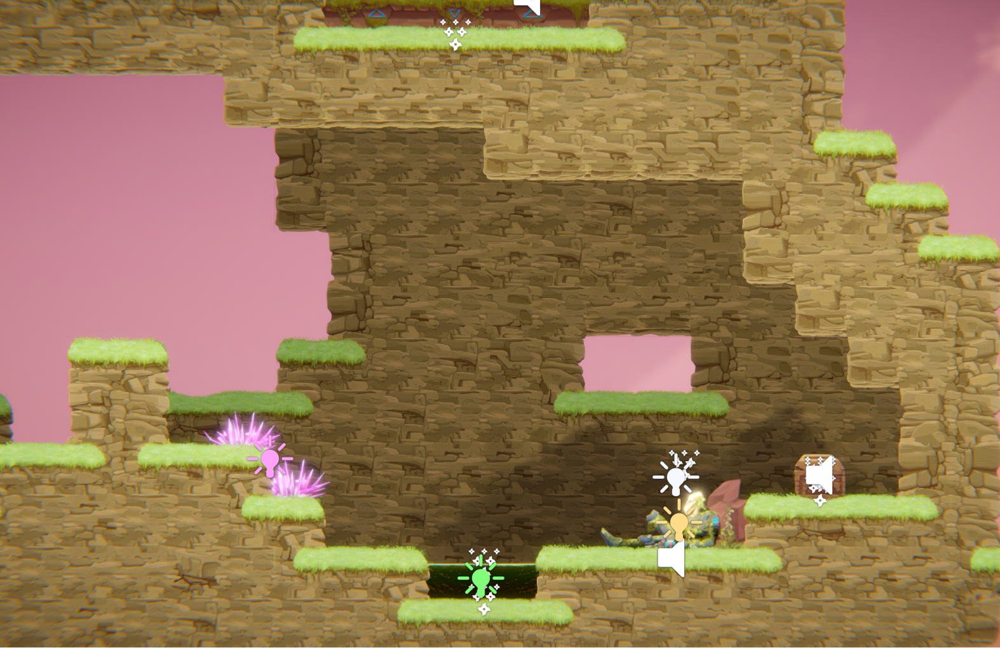
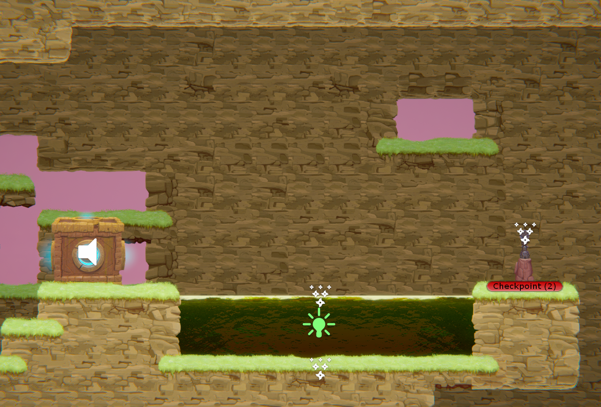
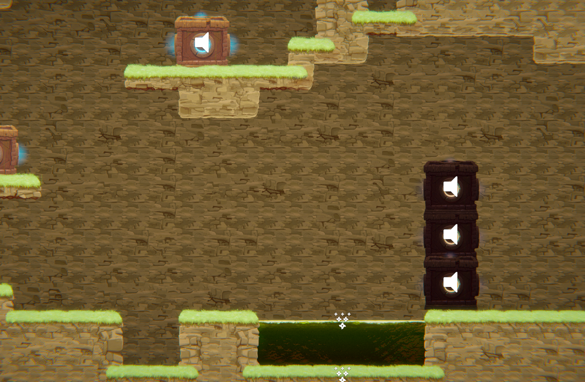
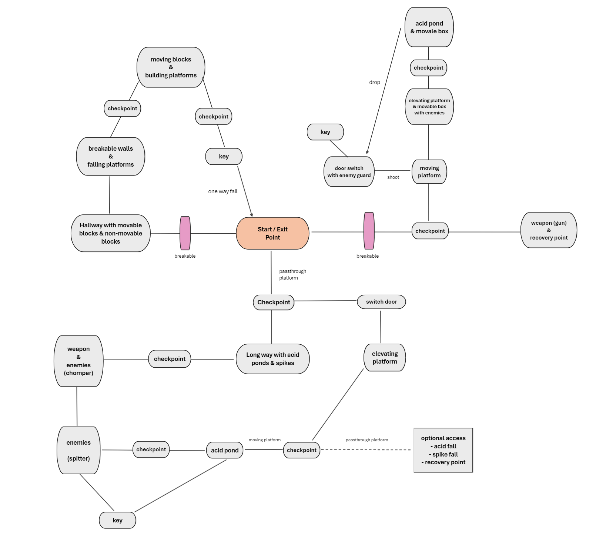
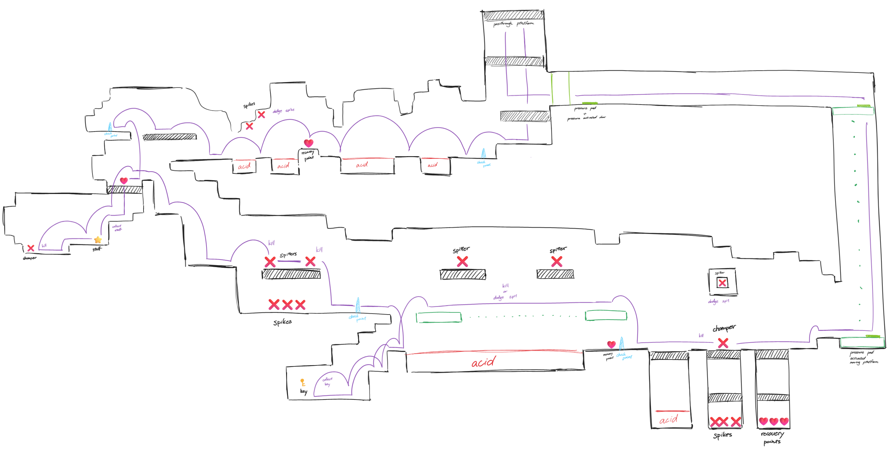
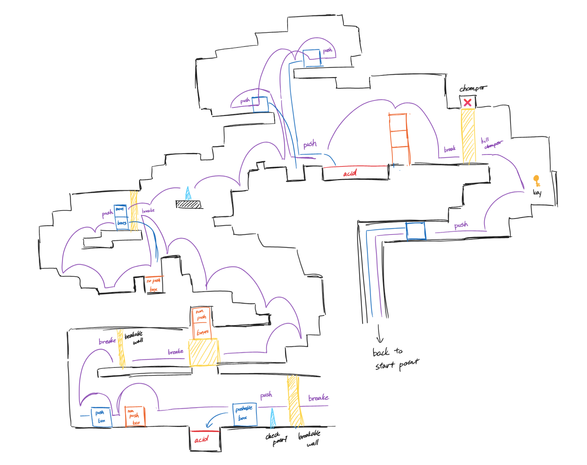
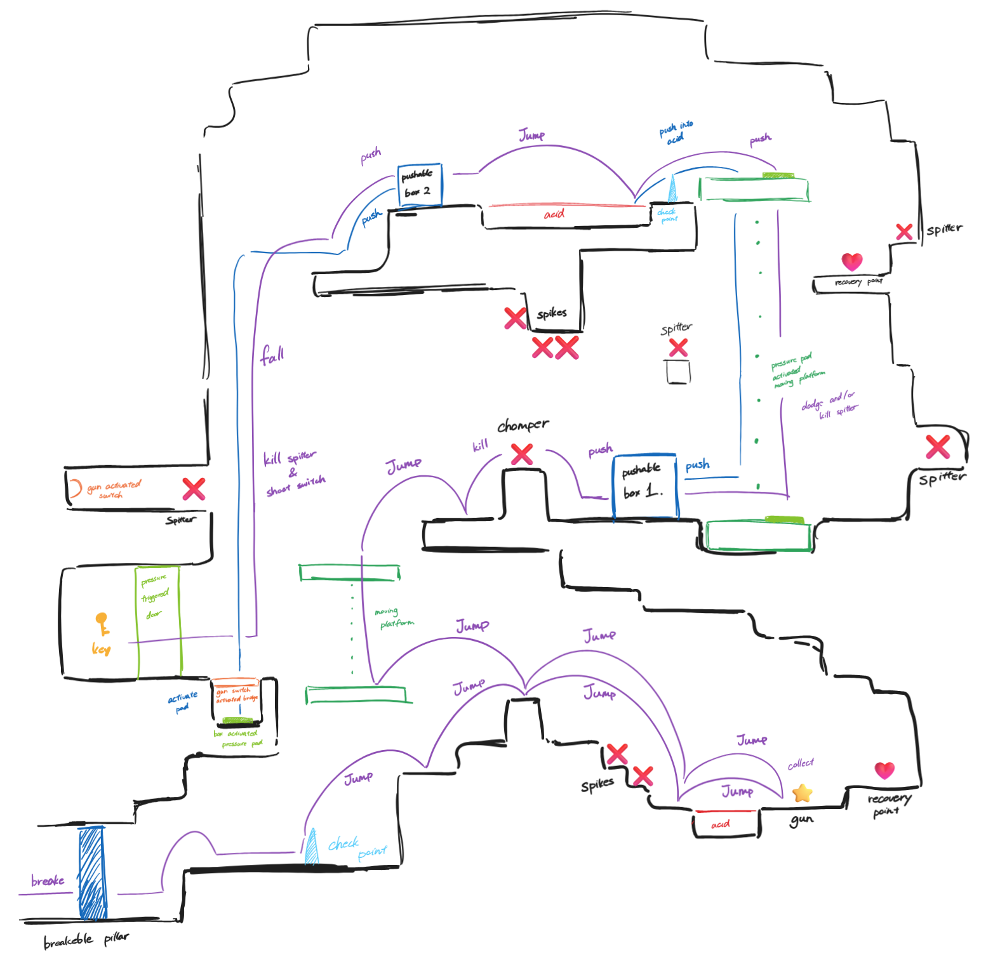

# COMP2150  - Level Design Document
### Name: [Mai Kudo]
### Student number: [47849754] 

## 1. Player Experience (~700 words)

### 1.1. Discovery
I have put a lot of thought into this stage to keep players curious at all times. When players start the game, they first spawn in a large space. They then discover an exit above their head and a passageway (section 1) below them that they can pass through. The passage continues to the left and right of the large space, but the walls are in the way and prevent the player from proceeding. As the player does not have a weapon at this point, the player cannot proceed by breaking the walls on either side and as a result, they will have to go through the first passageway the player can pass through.

 
The main discoveries in Section 1 are hazards (acid and spikes), weapons (staff) and the act of defeating enemies.

Towards the end of the section, the player will discover how to use platforms and doors operated by pressure pads. This gimmick is also applied and used in later sections.

Section 2 consists mainly of destructible walls and block-based gimmicks. There are two types of blocks: those that can be moved by pushing them and those that cannot be moved by pushing them (black blocks in the image: slightly modified behaviours from existing data).

Section 3 consists of the introduction of the gun + a combination of the gimmicks so far.
The player discovers the strategy by applying the gimmicks that have been mentioned so far together with the gun.

### 1.2. Drama
Section 1 has safe zones and hazardous environments respectively, giving a sense of both security and danger depending on the location. It is designed to require some skill, with gimmicks that can kill the player instantly if they make the slightest mistake.

Section 2 has fewer hazards, so the tension in terms of danger is less intense and the focus is more on moving blocks, so the player can feel relatively safe throughout this level.

Section 3 is where the player will experience the most tension, as they are always next to the hazards. It is also designed to require a bit of control skill, which can lead to a sense of frustration.

### 1.3. Challenge
The most difficult part of this level is the technical aspect of the controls for jumping over the acid ponds. Most of the acid ponds on this level are designed to be just short of being jumped over, and if the timing of the jump is even slightly off, the player will jump straight into the pond and die. The placement of the ceilings where the acid ponds are located is also carefully designed, so that if the player jumps at the wrong time, they will crash into a wall and not be able to jump over to the other side of the acid pond.

Otherwise, this level consists of relatively simple puzzles and does not require any advanced control skills.

### 1.4. Exploration
When the player starts the game, they first find a floating platform with an exit above their head. The player attempts to jump onto the platform with the exit but is unable to access it because it is too high to jump onto. They are then forced to explore every corner of the vast map, driven by the question and curiosity of "What do I have to do to reach here?".
Players will later be able to take up weapons and break down walls to explore areas that were previously unexplored. Each of the three areas has its own very unique traps. By playing around with many of the gimmicks, various patterns can be discovered, sparking how to progress through the sections.

## 2. Core Gameplay (~400 words)

### 2.1. Passthrough Platforms
To familiarise them with the system as soon as possible, as it is used throughout the level.

### 2.2. Checkpoints
To teach the player that when they die, they will come back here.

### 2.3. Acid
To make the player aware of what objects present a hazard and when.

### 2.4. Spikes
Same reason as above + to teach that this form of danger also exists.

### 2.5. Health Pickups
To teach the player how they can recover after sustaining some damage from dangerous objects.

### 2.6. Weapon Pickup (Staff)
To teach the player that they need to use weapons to defeat or destroy something.

### 2.7. Chompers
To teach the player that there are enemies like this and that they can use weapons to defeat them.

### 2.8. Spitters
To make the player aware that there are enemies with different attack patterns.

### 2.9. Moving Platforms
To make the player aware that they can travel on it as well as on foot. To teach the player that they can use this to proceed where it is dangerous to go on foot.

### 2.10. Keys
To show that the aim is to use the keys collected to ultimately escape the level. 

/ * optional prefabs

### 2.11. pressure pad activated elevating platform
Introduction that all moving platforms are not automatic and can be moved by you. Used in several sections.

### 2.12. pressure pad activated triger door
The door in front of them could not be opened from the way they came, indicating that there was a switch somewhere.

### 2.13. breakable walls
Mechanic used to facilitate progression through the stages where weapons are used to destroy objects. Not used in Section 1.

### 2.14. pushable blocks
The platform can be partially modified by moving it. It was shown to act as an obstacle or to allow access to paths that could not be reached by jumping or walking by creating a new platform from moving it around. 

### 2.15. non-pushable blocks (MY CUSTOM PREFAB BY MODDING PUSHABLE BLOCK)
This block was modified from the original push-to-move block to create a block that does not move when pushed. If there is a breakable wall under the block, it can be broken and dropped down. This block showed that a path blocked by this block could be dropped down and opened by breaking a destructible block under the block.
Only used in Section 2.

### 2.17. bullet activated bridge
To show that it is possible to move certain platforms by firing bullets.

* /

### 2.16. Weapon Pickup (Gun)
To teach the player that weapons can be used not only to destroy enemies and objects, but also to activate objects

## 3. Spatiotemporal Design
 
### 3.1. Molecule Diagram

### 3.2. Level Map – Section 1

### 3.3. Level Map – Section 2

### 3.4. Level Map – Section 3

## 4. Iterative Design (~400 words)
When I designed and playtested a stage where a player jumps over a pond of acid, I realised it was too easy. Intuitively, I thought that this was due to the lack of obstacles and enemies, so I experimented with more complex ceilings and uneven footholds. This time, I was confronted with the problem that the ceiling was too low, so when I flew, I crashed and fell straight into a pool of acid, and the scaffolding at the landing point was too high for the character to jump over. However, if I removed the obstacles, it became a boring stage with no substance, just like the initial stage plan.
When I racked my brain about how to improve it, I wondered if it would be possible to create a stage by making good use of the problem of the unevenness of the ceiling and scaffolding.
As for the experiment, I conducted:
- how many squres can the player jump?
- how many squares high can the player jump?
- if there is an obstacle such as a ceiling diagonally in front of the player and the player jumps with maximum jump and forward force, how many squares away and how high from where the player is standing will the player collide with the obstacle?
After several playtests under these conditions, I finally succeeded in creating a play route where the landing point is just out of reach when the player jumps, and just above the character's head, without hitting any ceiling or obstacle.
Thanks to the success of this structure, the difficulty of the level as a whole was originally easy, but the structures in various positions made the difficulty moderately balanced.

** changes made after design map **
- In section 2, one extra non-movable block added on block pile with 5 hit breakable block.
- In section 2, the sequence where the player pushes and drops down two blocks at the top section, an extra playthrough in which the player pushes one of the blocks into an acid pool is added. The original playthrough in the design map above is too far for the player to jump and land on the top of the piled blocks, and this resulted in them falling straight into the acid pool.

