[](https://classroom.github.com/a/YyUO0xtt)
# COMP2150  - Level Design Document
### Name: [Mai Kudo]
### Student number: [47849754] 

This document discusses and reflects on the design of your platformer level for the Level Design assessment. It should be 1500 words. Make sure you delete this and all other instructional text throughout the document before checking your word count prior to submission. Hint: You can check word count by copying this text into a Word or Google doc.

Your document must include images. To insert an image into your documentation, place it in the "DocImages" folder in this repo, then place the below text where you want the image to appear:

```

```

Example:


## 1. Player Experience (~700 words)
Outline and justify how your level design facilitates the core player experience goals outlined in the assignment spec. Each section should be supported by specific examples and screenshots of your game encounters that highlight design choices made to facilitate that particular experience.

### 1.1. Discovery
I have put a lot of thought into this stage to keep players curious at all times. When players start the game, they first spawn in a large space. They then discover an exit above their head and a passageway (section 1) below them that they can pass through. The passage continues to the left and right of the large space, but the walls are in the way and prevent the player from proceeding. As the player does not have a weapon at this point, the player cannot proceed by breaking the walls on either side and as a result, they will have to go through the first passageway the player can pass through.
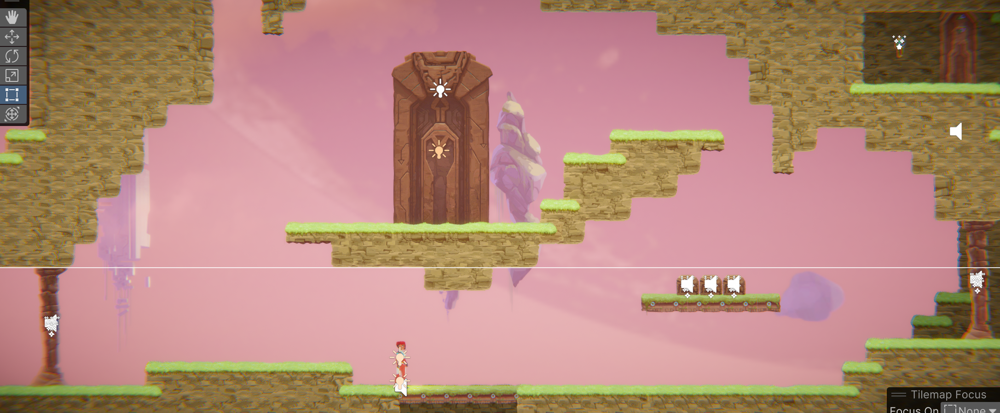
 
The main discoveries in Section 1 are hazards (acid and spikes), weapons (staff) and the act of defeating enemies.
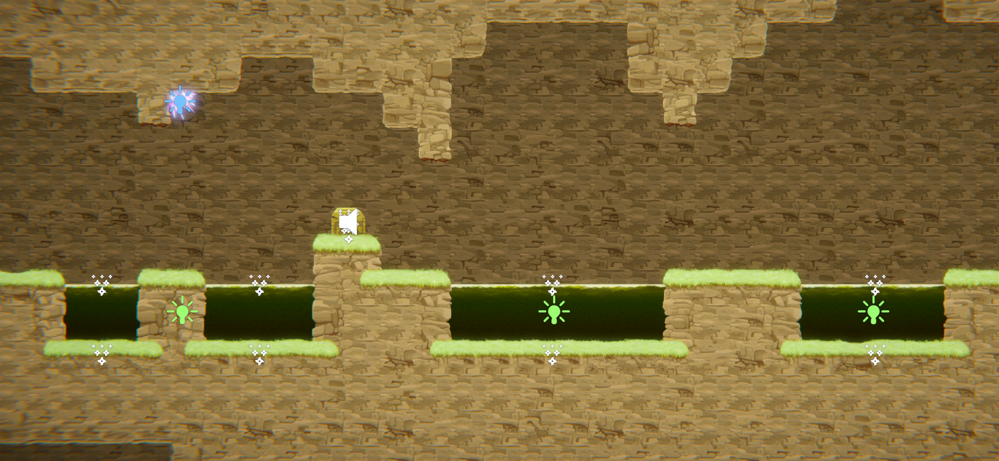
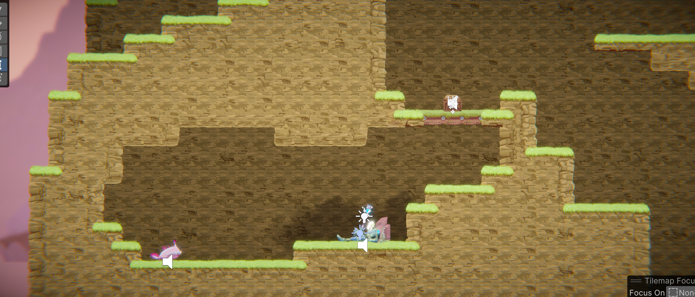


Towards the end of the section, the player will discover how to use platforms and doors operated by pressure pads. This gimmick is also applied and used in later sections.
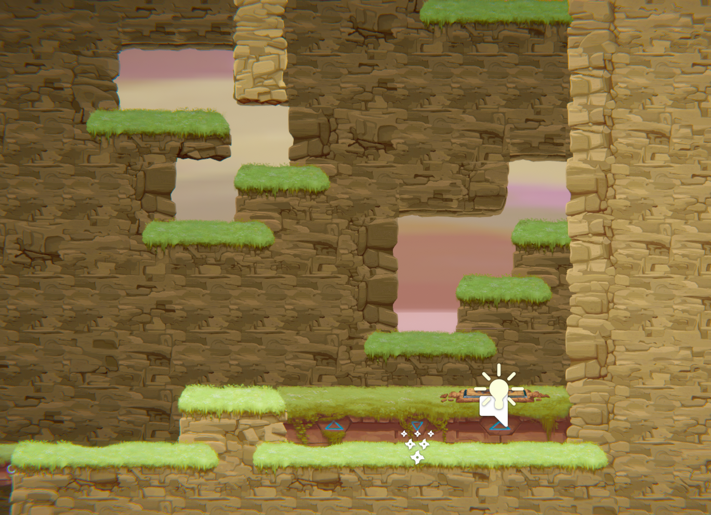
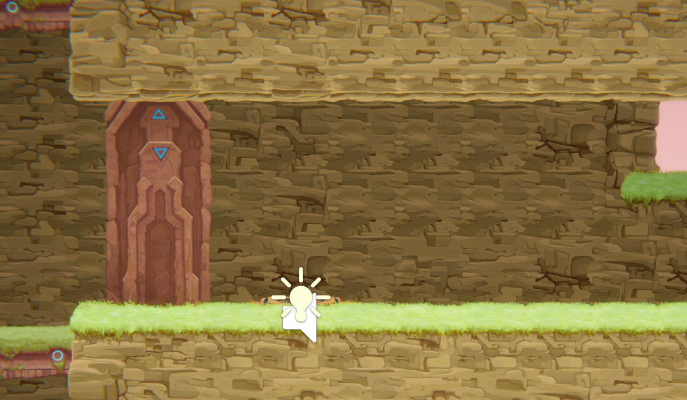

Section 2 consists mainly of destructible walls and block-based gimmicks. There are two types of blocks: those that can be moved by pushing them and those that cannot be moved by pushing them (black blocks in the image: slightly modified behaviours from existing data).
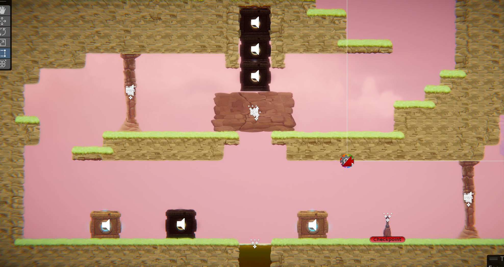

Section 3 consists of the introduction of the gun + a combination of the gimmicks so far.
The player discovers the strategy by applying the gimmicks that have been mentioned so far together with the gun.
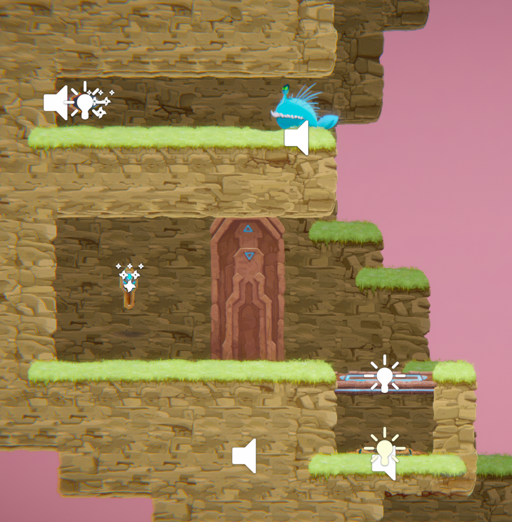
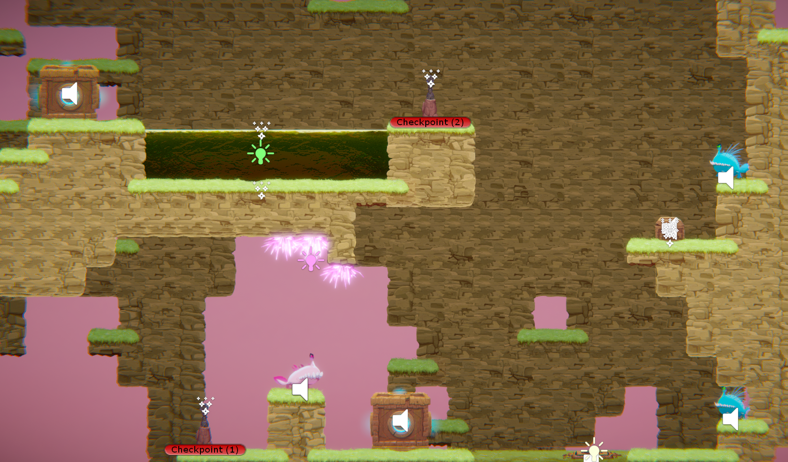


### 1.2. Drama
Section 1 has safe zones and hazardous environments respectively, giving a sense of both security and danger depending on the location. It is designed to require some skill, with gimmicks that can kill the player instantly if they make the slightest mistake.
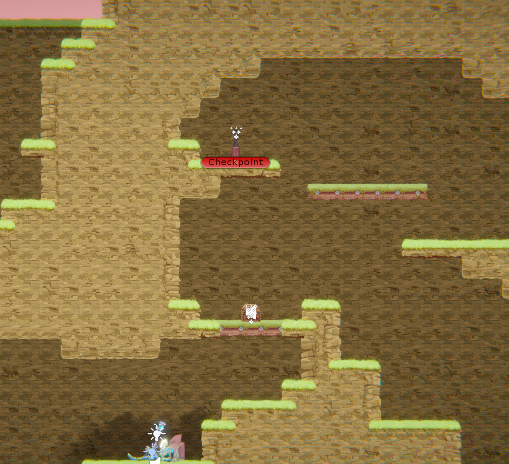
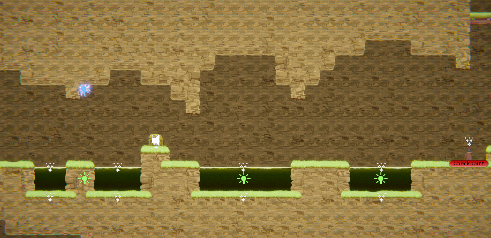

Section 2 has fewer hazards, so the tension in terms of danger is less intense and the focus is more on moving blocks, so the player can feel relatively safe throughout this level.
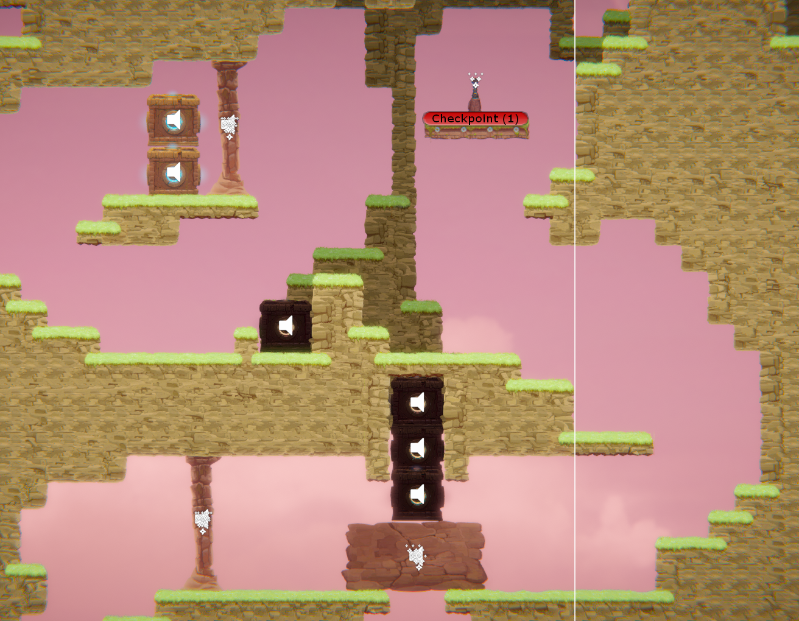

Section 3 is where the player will experience the most tension, as they are always next to the hazards. It is also designed to require a bit of control skill, which can lead to a sense of frustration.
[](DocImages/dr4.png)

### 1.3. Challenge
What are the main challenges? How have you designed and balanced these challenges to control the difficulty curve and keep the player in the flow channel?

### 1.4. Exploration
When the player starts the game, they first find a floating platform with an exit above their head. The player attempts to jump onto the platform with the exit but is unable to access it because it is too high to jump onto. They are then forced to explore every corner of the vast map, driven by the question and curiosity of "What do I have to do to reach here?".
Players will later be able to take up weapons and break down walls to explore areas that were previously unexplored. Each of the three areas has its own very unique traps. By playing around with many of the gimmicks, various patterns can be discovered, sparking how to progress through the sections.


## 2. Core Gameplay (~400 words)
A section on Core Gameplay, where storyboards are used to outline how you introduce the player to each of the required gameplay elements in the first section of the game. Storyboards should follow the format provided in lectures.

Storyboards can be combined when multiple mechanics are introduced within a single encounter. Each section should include a sentence or two to briefly justify why you chose to introduce the mechanic/s to the player in that sequence.

You should restructure the headings below to match the order they appear in your level.

### 2.1. Acid

### 2.2. Checkpoints

### 2.3. Chompers

### 2.4. Health Pickups

### 2.5. Keys

### 2.6. Moving Platforms

### 2.7. Passthrough Platforms

### 2.8. Spikes

### 2.9. Spitters

### 2.10. Weapon Pickup (Gun)

### 2.11. Weapon Pickup (Staff)

## 3. Spatiotemporal Design
A section on Spatiotemporal Design, which includes your molecule diagram and annotated level maps (one for each main section of your level). These diagrams may be made digitally or by hand, but must not be created from screenshots of your game. The annotated level maps should show the structure you intend to build, included game elements, and the path the player is expected to take through the level. Examples of these diagrams are included in the level design lectures.

No additional words are necessary for this section (any words should only be within your images/diagrams).
 
### 3.1. Molecule Diagram

### 3.2. Level Map – Section 1

### 3.3.	Level Map – Section 2

### 3.4.	Level Map – Section 3

## 4. Iterative Design (~400 words)
Reflect on how iterative design helped to improve your level. Additional prototypes and design artefacts should be included to demonstrate that you followed an iterative design process (e.g. pictures of paper prototypes, early grey-boxed maps, additional storyboards of later gameplay sequences, etc.). You can also use this section to justify design changes made in Unity after you drew your level design maps shown in section 3. 

You should conclude by highlighting a specific example of an encounter, or another aspect of your level design, that could be improved through further iterative design.

## Generative AI Use Acknowledgement

Use the below table to indicate any Generative AI or writing assistance tools used in creating your document. Please be honest and thorough in your reporting, as this will allow us to give you the marks you have earnt. Place any drafts or other evidence inside this repository. This form and related evidence do not count to your word count.
An example has been included. Please replace this with any actual tools, and add more as necessary.


### Tool Used: ChatGPT
**Nature of Use** Finding relevant design theory.

**Evidence Attached?** Screenshot of ChatGPT conversation included in the folder "GenAI" in this repo.

**Additional Notes:** I used ChatGPT to try and find some more relevant design theory that I could apply to my game. After googling them, however, I found most of them were inaccurate, and some didn't exist. One theory mentioned, however, was useful, and I've incorporated it into my work.

### Tool Used: Example
**Nature of Use** Example Text

**Evidence Attached?** Example Text

**Additional Notes:** Example Text


